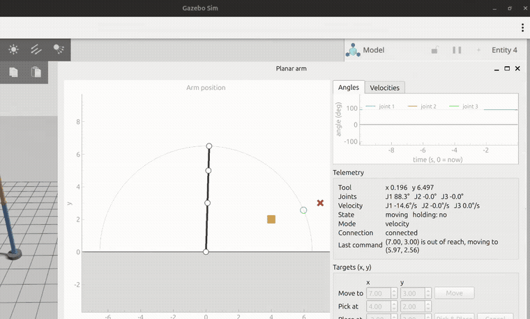

# Planar arm: ROS 2 controller and GUI



ROS 2 controller and GUI for a three-joint planar arm, with a Gazebo simulation. The kinematics library, `planar_arm.py`, was supplied by Kineshia Robotics and is used unchanged.

[Design note](DESIGN_NOTE.md) · [Sim to hardware](SIM_TO_HARDWARE.md)

## Demo
[demo.webm](https://github.com/user-attachments/assets/25749c24-dfc2-4237-8fb3-1587000c3c5e)

## The arm

| | |
|---|---|
| Link lengths | 3.0, 2.0, 1.5 |
| Joint 1 limits | 0° to 180° |
| Joint 2 and 3 limits | -120° to 120° |
| Ground | no part of the arm below `y = 0` |

## What it does

- **Controller:** checks each target, plans a smooth joint move, publishes `/joint_states` at 50 Hz.
- **GUI:** draws the arm, plots joint angles and speeds, shows the tool position, sends targets.
- **Pick and place:** move → pick → move → place.
- **Velocity mode** (`control_mode:=velocity`).
- **Pick-and-place action** with feedback and cancel.
- **Gazebo**, driven by the same controller through `ros_gz_bridge` (velocity mode).
- **Lifecycle node** and **timer-jitter log**.

## Build

Ubuntu 24.04, ROS 2 Jazzy, from the repository root:

```bash
sudo apt install python3-colcon-common-extensions python3-numpy python3-pyqt5 python3-pyqtgraph ros-jazzy-ros-gz
source /opt/ros/jazzy/setup.bash
colcon build
source install/setup.bash
```

## Run

Each command opens the GUI.

```bash
ros2 launch planar_arm_control bringup.launch.py                        # position mode
ros2 launch planar_arm_control bringup.launch.py control_mode:=velocity # velocity mode
ros2 launch planar_arm_gazebo gazebo.launch.py                          # Gazebo
```

## Try it

The GUI opens with these targets filled in.

1. **Move** `(7, 3)`: out of reach, so the arm goes to the closest point, `(5.97, 2.56)`.
2. **Pick & Place** `(4, 2)` → `(-3, 3)`. **Cancel** stops the arm.

Without the GUI:

```bash
ros2 service call /move_to_target planar_arm_msgs/srv/MoveToTarget "{x: 7.0, y: 3.0}"
```

## Interfaces

| Name | What |
|---|---|
| `/move_to_target` | service: move to `(x, y)` |
| `/pick_place` | action: pick and place, with feedback and cancel |
| `/joint_states` | joint angles and speeds, 50 Hz |
| `/arm_status` | phase, holding, mode |

## License

Apache-2.0, see [LICENSE](LICENSE). `planar_arm.py` belongs to Kineshia Robotics and is not covered.
